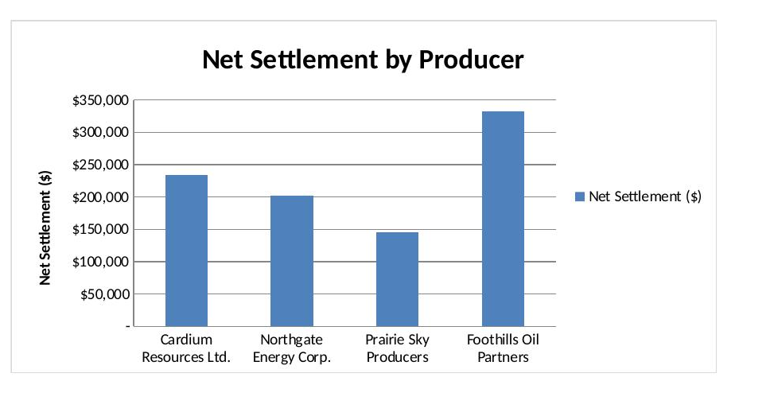

# Producer Settlement & Equalization Model

A self-contained Excel model simulating a monthly producer settlement process at a shared oil and gas facility, built to understand the mechanics behind volume allocation, equalization, and profit-sharing.

📄 [Download the full model](producer_settlement_model.xlsx)

## Preview

## Why I built this

I wanted hands-on exposure to how a shared-facility settlement actually flows: from raw metered volumes at the wellhead, through equalization and shrinkage adjustments, to a final invoice-ready net settlement per producer.

## Data sources

- **Sales price is real, publicly sourced market data**: WTI Cushing, OK spot price, July 2026 monthly average ($79.71/bbl), sourced from the U.S. Energy Information Administration (EIA). Cited directly in the workbook (Assumptions sheet, cell C12).
- **Producer names, LSDs, metered volumes, meter quality factors, operating cost, and shrinkage rate are hypothetical.** I don't have access to real producer transaction data, so these were constructed to be realistic (LSDs follow correct Alberta land-identifier formatting) but are not drawn from any real facility or company. This is stated explicitly inside the workbook itself, not just in this README.

## What the model does

The workbook has three sheets:

1. **Assumptions** — Facility-level inputs: total operating cost, sales price, and facility shrinkage rate. All key assumptions are isolated here so the whole model recalculates from a single source of truth.
2. **Volume Allocation** — Takes each producer's raw metered volume and applies a meter quality factor to calculate an equalized volume, then computes each producer's percentage share of the total.
3. **Settlement Summary** — Applies facility shrinkage to get post-shrinkage volume, calculates gross revenue at the facility sales price, allocates operating cost pro-rata by volume share, and nets it all out to a final settlement amount per producer, with a chart visualizing net settlement by producer.

## Key concepts modeled

- **Equalization**: adjusting each producer's raw delivered volume for meter calibration variance, so no producer is over- or under-credited due to metering differences.
- **Pro-rata cost allocation**: operating costs are shared across producers according to their percentage of total facility volume, a standard shared-facility cost-allocation method.
- **Shrinkage**: volume lost to measurement and processing is applied at the facility level before revenue is calculated, reflecting real-world facility losses.

## Tools used

Excel (formulas only, fully recalculating — no hardcoded results). Every number a user might change lives in a labeled, color-coded input cell (blue text, yellow fill for key assumptions) so the whole settlement recalculates automatically.

## Note

This is a self-directed learning project. It combines one real, cited data point (WTI spot price) with hypothetical producer and facility data for demonstration purposes. It is not based on any employer's proprietary methodology or real producer data.
